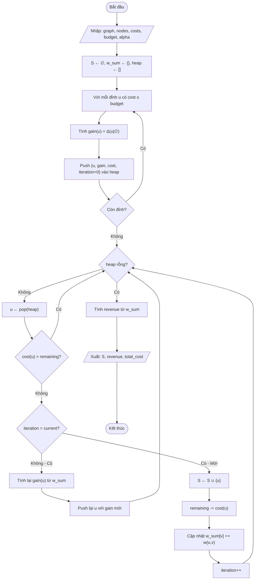

# Tối đa hoá doanh thu trên mạng thảo luận Wikipedia

## 1. Mô tả bài toán

Cho một mạng xã hội (mạng thảo luận Wikipedia) được mô hình hóa dưới dạng đồ thị có hướng hoặc vô hướng:
- **G = (V, E)**, trong đó:
  - **V** là tập các đỉnh, mỗi đỉnh tương ứng với một người dùng.
  - **E** là tập các cạnh, mỗi cạnh \((u, v) \in E\) biểu diễn một mối quan hệ/tương tác giữa hai người dùng.

Mỗi cạnh \((u, v)\) được gán một **trọng số dương** \(w(u, v)\), được sinh ngẫu nhiên theo phân phối đều trong khoảng \([0, 1]\). Trọng số này phản ánh cường độ ảnh hưởng hoặc mức độ tương tác giữa hai người dùng.

## 2. Chi phí của đỉnh

Mỗi đỉnh \(u \in V\) được gán một **chi phí dương** \(c(u)\), được xác định dựa trên tổng trọng số các cạnh liên quan đến đỉnh đó:

Công thức này đảm bảo:
- Chi phí \(c(u)\) tăng khi mức độ kết nối (tổng trọng số cạnh) của đỉnh \(u\) tăng.
- Chi phí luôn nằm trong khoảng \((0, 1)\).

## 3. Hàm doanh thu

Với một tập con các đỉnh được chọn \(S \subseteq V\) (tập seed), **doanh thu** thu được từ \(S\) được xác định bởi hàm:

trong đó:
- \(\alpha \in (0,1]\) là tham số điều chỉnh mức độ lợi suất giảm dần (diminishing returns).

Hàm \(f(S)\) đo lường tổng mức ảnh hưởng mà tập seed \(S\) tác động lên các đỉnh chưa được chọn, và mang tính **dưới mô-đun (submodular)** khi \(0 < \alpha \le 1\).

## 4. Ràng buộc ngân sách

Cho một **ngân sách** \(B > 0\). Một tập seed \(S\) được coi là hợp lệ nếu tổng chi phí không vượt quá ngân sách:

## 5. Mục tiêu tối ưu

Mục tiêu của bài toán **Revenue Maximization (RM)** là:

Nói cách khác, bài toán yêu cầu lựa chọn một tập người dùng ban đầu (seed set) sao cho:
- Tổng chi phí kích hoạt không vượt quá ngân sách cho phép.
- Doanh thu (mức độ ảnh hưởng kỳ vọng) đạt giá trị lớn nhất.

## 6. Ý nghĩa trong bối cảnh Wikipedia

Trong mạng thảo luận Wikipedia:
- Các đỉnh đại diện cho người dùng tham gia thảo luận.
- Trọng số cạnh phản ánh khả năng ảnh hưởng giữa người dùng.
- Tập seed \(S\) có thể được hiểu là nhóm người dùng được ưu tiên kêu gọi, gợi ý hoặc tác động.

